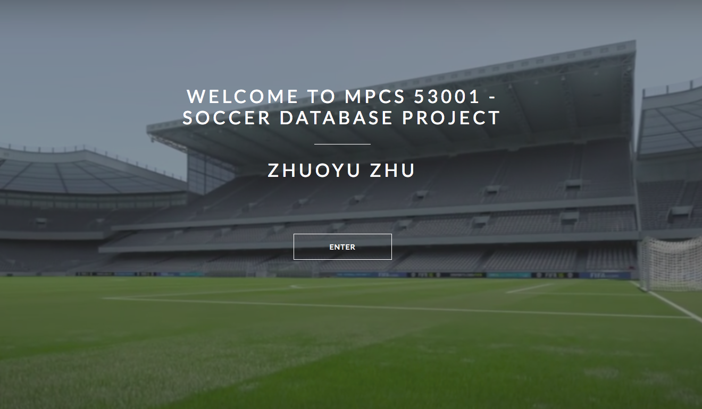
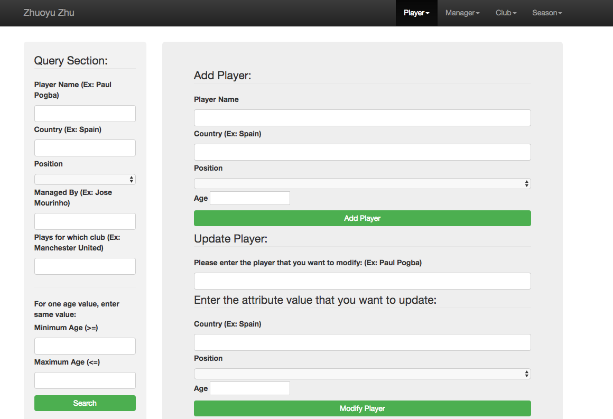
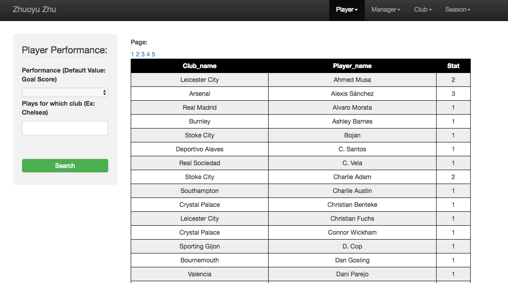

# MPCS53001-Soccer-Database-Project
This is my MPCS53001 database final project about soccer player's info and performance statistics. I start by gathering requirements and modelling a relational database using an Entity-Relationship Diagram (ERD). Concepts covered include entity sets and relationships, using keys as a unique identifier for each object in an entity set, one-one, many-one, and many-many relationships as well as translational rules from conceptual modeling (ERD) to relational table definitions. I also examined the relational model and functional dependencies along with their application to the methods for improving database design: normal forms and normalization.

After designing and modeling my soccer database, a simple web application was developed for users to manipulate soccer player's data at the back end.(URL:http://mpcs53001.cs.uchicago.edu/~zhuoyuzhu/Final.html)

**1. Languages:** PHP, MySQL, HTML, CSS, JavaScript, Bootstrap

**2. SQL Techniques:** Subqueries, aggregation, various types of joins, functions, triggers and stored procedures

## 1. Home Page

## 2. Player Info Page

## 3. Player Performance Page

